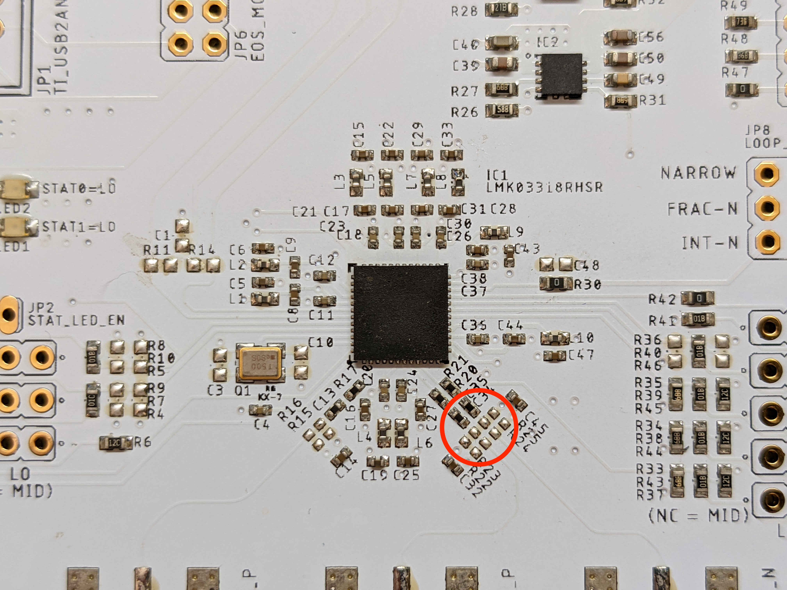
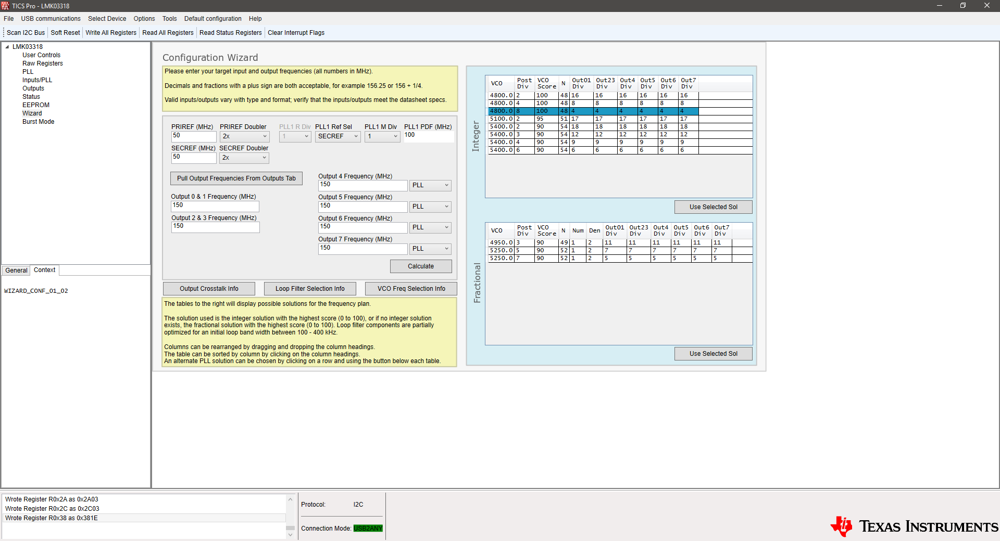

<h1>ISG Clock Generator Instructions:</h1>

This board is based off of the TI LMK03318EVM. Refer to the datasheet (http://www.ti.com/lit/ug/snau186/snau186.pdf) for detailed documentation and configuration instructions.

<h2>Required Rework</h2>

If assembled as specified in the BOM, the output coupling networks on channel 2 (the one with differential output) need to be reconfigured to work with the usual ISG CML2CMOS clock receiver design. Instead of DC coupling, each line should be AC-coupled and biased at around 0.8V. The required component changes are:

C34, C35 change from 0R jumper to (todo)
R22, R24 change from DNP to (todo)
R23, R25 change from DNP to (todo)

Location of channel 2's output coupling network:

<h2>Jumper Configuration</h2>

todo

<h2>Standard EEPROM Configuration Using TICS</h2>

todo

<h2>Custom EEPROM Configuration Using TICS</h2>

Step 1:

Before powering the PLL board, configure the jumpers and connect the TI USB2ANY adapter using the 10-pin ribbon cable.

Step 2:

Plug the TI USB2ANY in to the computer with a USB cable and launch the TICS Pro software. Make sure the adapter connects successfully. When first using the adapter, you will need to follow the on-screen instructions to update the firmware. To select the correct PLL chip, click "Select Device -> Clock Generator/Jitter Cleaner (Single Loop) -> LMK03318" in the main menu bar.

Step 3:

Power the PLL board using a 5V power supply. Hit the "Scan I2C Bus" button on the top-left side of the TICS Pro screen. If the PLL board is powered and connected correctly, the terminal in the bottom-left side of the screen will print: "A device responded at [addr]. Address will be updated."

Step 4:

Use pull-down menus under "Outputs" to configure the output driver type. Note that the configuration bits are written as soon as the menu item is clicked, you do not need to select the new settings and then separately hit a buttom to write to the PLL.

Step 5:

Go to "Wizard" and enter the desired frequencies on each output channel, then hit "Calculate" to populate the tables on the right side. With the tables populated, you can highlight one of the solutions and hit "Use Selected Sol" to program the PLL.

